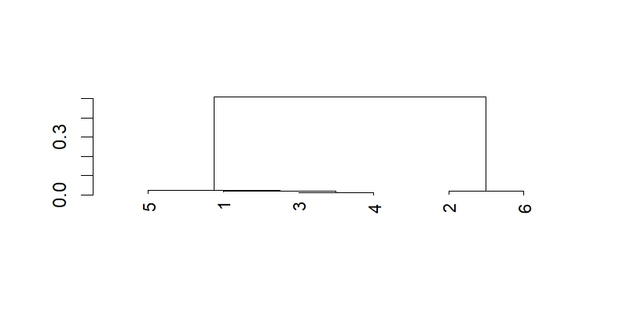

# BIO 410 Final Project
## Background
The data consist of 6 samples from the organism Ebola Virus(EBOV). Ebola virus is a negative-sense, single-stranded RNA virus belonging to the genus Ebolavirus within the family Filoviridae, which causes severe and often fatal hemorrhagic fever in humans and other primates (Geisbert et al., 2018).

## Purpose
The purpose of this project was to create a phylogenetic tree from 6 samples of Ebola Virus in order to determine the evolutionary relationships between the samples.

## Methods
Raw paired-end sequencing reads were generated using next-generation sequencing (NGS), which produces millions of short DNA reads from a biological sample. The 6 samples contained in the srijan/ folder were assembled into contigs using MEGAHIT, a fast and memory-efficient assembler designed for NGS data. Each sample was assembled separately using paired-end reads (sim_t1_1.fq/sim_t1_2.fq through sim_t6_1.fq/sim_t6_2.fq), producing assembly output folders t1_out/ through t6_out/, where the key output file in each folder is final.contigs.fa. Contigs shorter than 5000 bp were removed to retain only full or near-full genome sequences. The remaining contigs were aligned using the AlignSeqs function from the DECIPHER package in R. A maximum likelihood (ML) phylogenetic tree was then constructed from the alignment using the Treeline function, also from the DECIPHER package in R, with method = "ML" and showPlot = TRUE. The R script used for alignment and tree construction is BIO410_final_project.R. The alignment visualization is saved as alignment.html and the phylogenetic tree image is saved as phylogenetic_tree.png.

## Results

Here is the phylogenetic tree:

Explain
Based on the maximum likelihood phylogenetic tree, the 6 Ebola virus samples show two distinct evolutionary lineages. Samples 1, 3, 4, and 5 cluster tightly together on one branch of the tree, indicating they are closely related to each other with minimal genetic divergence. In contrast, samples 2 and 6 form a separate, more distantly related. This branching pattern suggests that these 6 samples likely originated from 2 distinct individuals or transmission chains: one individual or lineage represented by the closely related cluster of samples 1, 3, 4, and 5, and a second individual or lineage represented by samples 2 and 6. The genetic distance between the two main clades indicates differentiation between these lineages. This shows either the samples are collected from separate sources or  it represents transmission events that accumulated independent mutations over time.
